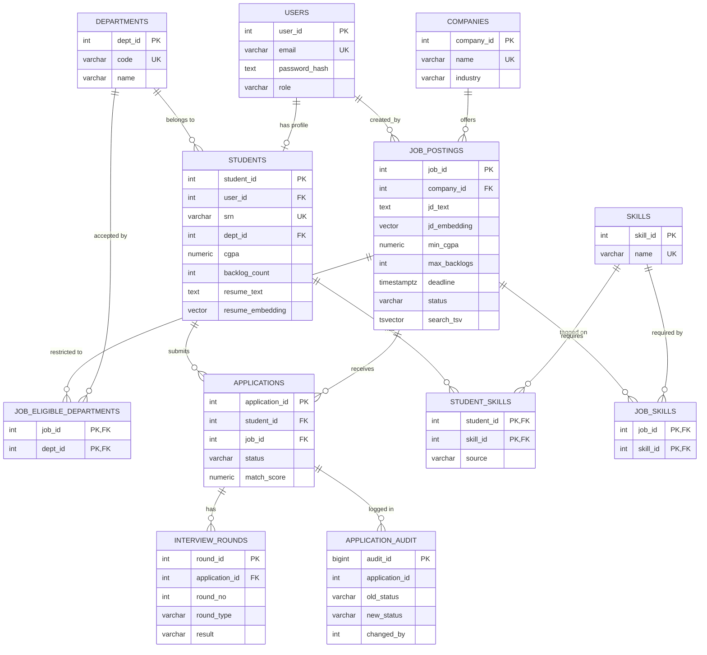

# HireSense ER diagram

Renders on GitHub (Mermaid). Source of truth for the tables is `db/01_schema.sql`.

```mermaid
erDiagram
    DEPARTMENTS ||--o{ STUDENTS : "belongs to"
    USERS ||--o| STUDENTS : "has profile"
    USERS ||--o{ JOB_POSTINGS : "created_by"
    COMPANIES ||--o{ JOB_POSTINGS : "offers"
    JOB_POSTINGS ||--o{ JOB_ELIGIBLE_DEPARTMENTS : "restricted to"
    DEPARTMENTS ||--o{ JOB_ELIGIBLE_DEPARTMENTS : "accepted by"
    STUDENTS ||--o{ APPLICATIONS : "submits"
    JOB_POSTINGS ||--o{ APPLICATIONS : "receives"
    APPLICATIONS ||--o{ INTERVIEW_ROUNDS : "has"
    APPLICATIONS ||--o{ APPLICATION_AUDIT : "logged in"
    STUDENTS ||--o{ STUDENT_SKILLS : "has"
    SKILLS ||--o{ STUDENT_SKILLS : "tagged on"
    JOB_POSTINGS ||--o{ JOB_SKILLS : "requires"
    SKILLS ||--o{ JOB_SKILLS : "required by"

    DEPARTMENTS { int dept_id PK  varchar code UK  varchar name }
    USERS { int user_id PK  varchar email UK  text password_hash  varchar role }
    STUDENTS {
        int student_id PK
        int user_id FK
        varchar srn UK
        int dept_id FK
        numeric cgpa
        int backlog_count
        text resume_text
        vector resume_embedding
    }
    COMPANIES { int company_id PK  varchar name UK  varchar industry }
    JOB_POSTINGS {
        int job_id PK
        int company_id FK
        text jd_text
        vector jd_embedding
        numeric min_cgpa
        int max_backlogs
        timestamptz deadline
        varchar status
        tsvector search_tsv
    }
    JOB_ELIGIBLE_DEPARTMENTS { int job_id PK,FK  int dept_id PK,FK }
    SKILLS { int skill_id PK  varchar name UK }
    STUDENT_SKILLS { int student_id PK,FK  int skill_id PK,FK  varchar source }
    JOB_SKILLS { int job_id PK,FK  int skill_id PK,FK }
    APPLICATIONS {
        int application_id PK
        int student_id FK
        int job_id FK
        varchar status
        numeric match_score
    }
    INTERVIEW_ROUNDS {
        int round_id PK
        int application_id FK
        int round_no
        varchar round_type
        varchar result
    }
    APPLICATION_AUDIT { bigint audit_id PK  int application_id  varchar old_status  varchar new_status  int changed_by }
```
